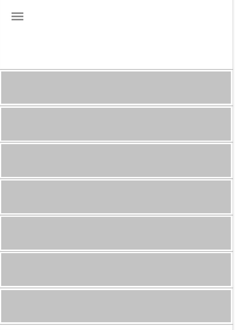
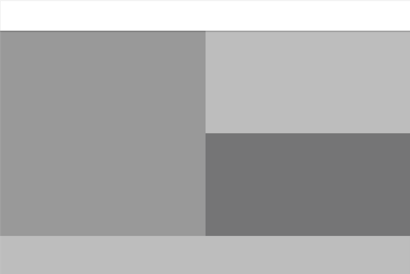

# Exercice 13

1. Reprendre l'exercice 11, Intégrez en HTML et CSS la maquette ci-après correspondant à la version mobile de [l'exercice 11](./exercice11.md).

---

## Maquette Mobile à intégrer (à réaliser pour cette exercice)

--- 

## Maquette Desktop correspondante

