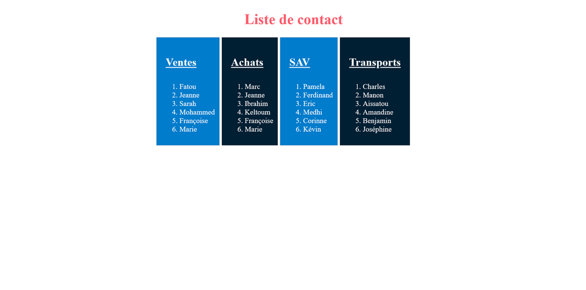

# Exercice 14

1. Intégrez en HTML et CSS les maquettes ci-après.
Les couleurs :
- Rouge : `#ff5b6b`
- Bleu clair : `#007ccc`
- Bleu foncé : `#001f33`

---

## Maquette desktop

---

## Maquette mobile

