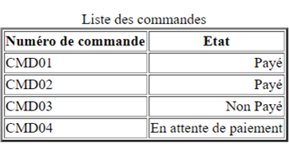

# Exercice 4

---

## Exigences

**1 exercice = 1 dossier**

---

## Documentation

- [Référence des éléments HTML](https://developer.mozilla.org/fr/docs/Web/HTML/Element)
- [Annexe](./annexe.md)

---

## Énoncé

1. Reproduire en HTML l'image ci-après.

