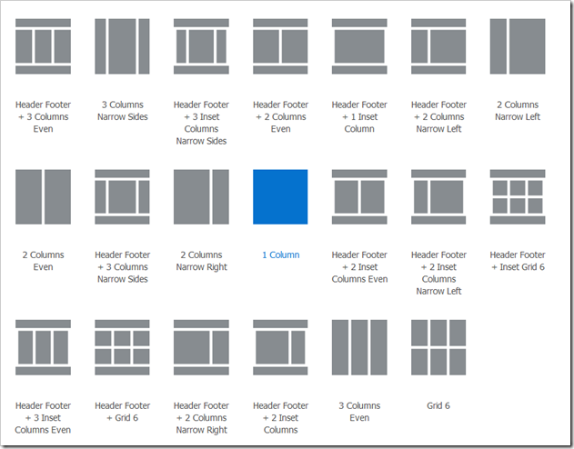

# Mise en page 8

1. Intégrez en HTML et CSS la maquette ci-après.

---

[Source image anotherwebcenterblog](https://anotherwebcenterblog.wordpress.com/2016/03/26/page-templates-page-layouts-and-page-styles-in-webcenter-portal-12c/)